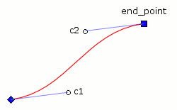

:mod:`potrace` -- API reference
===============================

.. module:: potrace

.. autofunction:: potracelib_version

Constants for :meth:`Bitmap.trace` *turnpolicy* parameter:

.. data:: TURNPOLICY_BLACK
.. data:: TURNPOLICY_WHITE
.. data:: TURNPOLICY_LEFT
.. data:: TURNPOLICY_RIGHT
.. data:: TURNPOLICY_MINORITY
.. data:: TURNPOLICY_MAJORITY
.. data:: TURNPOLICY_RANDOM

Bitmap objects
--------------

You start a trace by creating a :class:`Bitmap` instance, e.g.::

    from potrace import Bitmap

    # Initialize data, for example convert a PIL image to a numpy array
    # [...]

    bitmap = Bitmap(data)
    path = bitmap.trace()

.. autoclass:: Bitmap(data)
   
   .. automethod:: trace([turdsize, turnpolicy, alphamax, opticurve, opttolerance, progress_func])

Path objects
------------

:meth:`Bitmap.trace` returns a :class:`Path` instance, containing the whole
vectorized image.

.. autoclass:: Path

   .. attribute:: curves
      
      The list of :class:`Curve` objects composing the path.

   .. attribute:: curves_tree

      The top level :class:`Curve` objects in the tree representation of the
      path.

Curve objects
-------------

:class:`Path` objects are made of one or more of :class:`Curve` objects,
which are themselves composed of a list of segments.

Curves can have children curves. Children curves are guaranteed to be enclosed
by their parent.

.. autoclass:: Curve

   .. attribute:: regular
   .. attribute:: adaptive

      Constants for the :meth:`tesselate` method.

   .. autoattribute:: start_point

   .. attribute:: segments

      The list of segment objects that compose the curve.

   .. attribute:: children

      The list of children curves.

   .. automethod:: tesselate([method, res])

There are two types of segments, :class:`BezierSegment`:

and :class:`CornerSegment`:

.. image:: _static/corner.png

Since curves are always closed, segments only store their control points and
end point; their starting point is always the previous segment's end point. You
can check the :attr:`is_corner` attribute to determine the segments type easily.

.. autoclass:: BezierSegment
    
   .. attribute:: c1

      The segment's starting point control point.

   .. attribute:: c2
    
      The segment's end point control point.

   .. attribute:: end_point
      
      The segment's end point.

   .. attribute:: is_corner

      Always :const:`False`.

.. autoclass:: CornerSegment

   .. attribute:: c

      The segment's corner point.

   .. attribute:: end_point
      
      The segment's end point.

   .. attribute:: is_corner

      Always :const:`True`.
